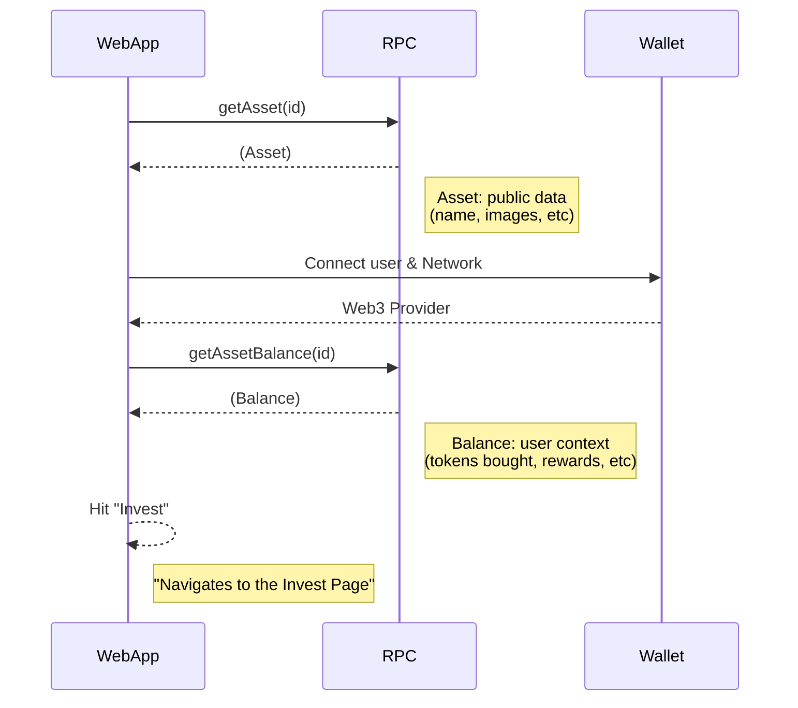

# Asset Details Page

```mermaid
sequenceDiagram

participant WebApp
participant RPC
participant Wallet
WebApp->>RPC: getAsset(id)
RPC-->>WebApp: (Asset)
Note right of RPC: Asset: public data<br>(name, images, etc)
WebApp->>Wallet: Connect user & Network
Wallet-->>WebApp: Web3 Provider

WebApp->>RPC: getAssetBalance(id)
RPC-->>WebApp: (Balance)
Note right of RPC: Balance: user context<br>(tokens bought, rewards, etc)
WebApp-->>WebApp: Hit "Invest"
Note right of WebApp: "Navigates to the Invest Page"
```
