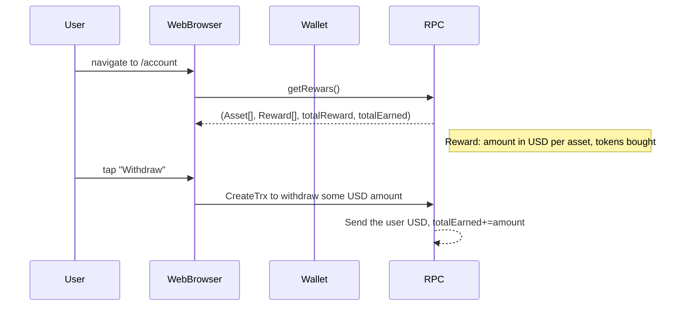

# Asset Detail Page

```mermaid
sequenceDiagram
  participant User
  participant WebBrowser
  participant Wallet
  participant RPC
  User->>WebBrowser: navigate to /account
  WebBrowser->>RPC: getRewars()
  RPC-->>WebBrowser: (Asset[], Reward[], totalReward, totalEarned)
  Note right of RPC: Reward: amount in USD per asset, tokens bought
  
  User->>WebBrowser: tap "Withdraw"
  WebBrowser->>RPC: CreateTrx to withdraw some USD amount
  RPC-->>RPC: Send the user USD, totalEarned+=amount
  
```

# Refs
https://creately.com/blog/diagrams/sequence-diagram-tutorial/
