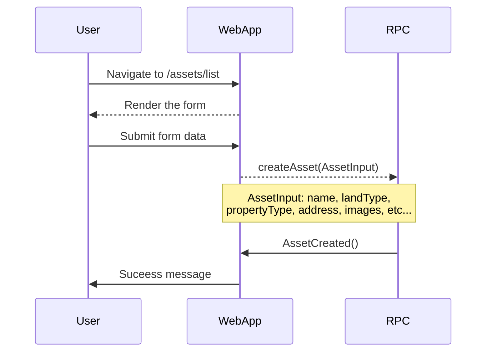

# List Asset

```mermaid
sequenceDiagram

participant User
participant WebApp
participant RPC
User->>WebApp: Navigate to /assets/list
WebApp-->>User: Render the form
User->>WebApp: Submit form data
WebApp-->>RPC: createAsset(AssetInput)
Note over WebApp, RPC: AssetInput: name, landType,<br>propertyType, address, images, etc... 
RPC->>WebApp: AssetCreated()
WebApp->>User: Suceess message
```
