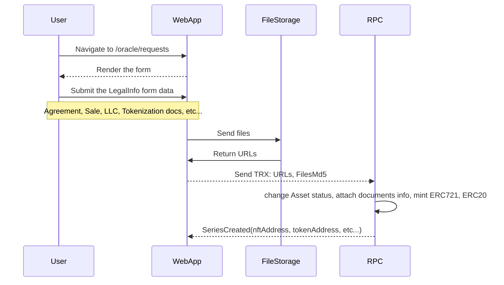

# Series Company Registering

```mermaid
sequenceDiagram

participant User
participant WebApp
participant FileStorage
participant RPC

User->>WebApp: Navigate to /oracle/requests
WebApp-->>User: Render the form
User->>WebApp: Submit the LegalInfo form data
Note over User, WebApp: Agreement, Sale, LLC, Tokenization docs, etc...
WebApp->>FileStorage: Send files
FileStorage->>WebApp: Return URLs
WebApp-->>RPC: Send TRX: URLs, FilesMd5
RPC->>RPC: change Asset status, attach documents info, mint ERC721, ERC20
RPC-->>WebApp: SeriesCreated(nftAddress, tokenAddress, etc...)
```
